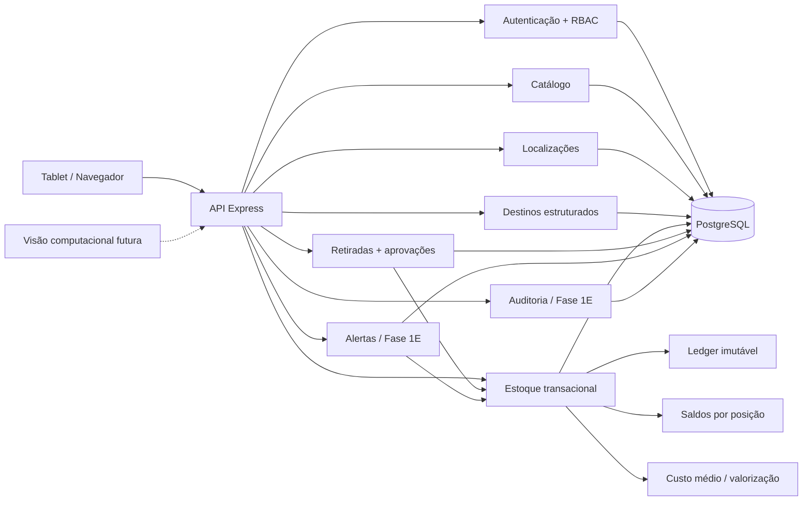

<h1 align="center">A.L.M.A.</h1>
<p align="center"><strong>Armazenamento, Localização, Movimentação e Autenticação</strong></p>
<p align="center">Sistema inteligente de almoxarifado industrial com rastreabilidade física, estoque transacional, retiradas auditáveis e operação pensada para tablet.</p>

<p align="center">
  
  
  
  
  <a href="https://github.com/tombemol/A.L.M.A/actions/workflows/ci.yml"></a>
</p>

<p align="center">
  <a href="https://tombemol.github.io/A.L.M.A/"><strong>▶ Abrir demonstração para tablet</strong></a>
</p>

> 🚧 **Estado atual:** Fases **1A, 1B, 1C e 1D concluídas**. A **Fase 1E está em andamento**, adicionando políticas de reposição, alertas operacionais idempotentes e auditoria ampliada. A demonstração da branch da 1E também inaugura o design system **Industrial Control Room**, guiado por `PRODUCT.md`, `DESIGN.md` e pelas heurísticas do **Impeccable**.

## 🧭 Visão geral

A **A.L.M.A.** nasceu para tirar o almoxarifado da clássica tecnologia industrial “acho que está naquela prateleira”. O sistema organiza usuários, produtos, endereços físicos, saldos, movimentações e retiradas com regras explícitas, autorização por papel e histórico preservado.

A arquitetura segue um **monólito modular**. Catálogo, localização, autenticação, estoque, destinos e retiradas compartilham a mesma fronteira de dados e usam transações serializáveis nos fluxos que não podem tolerar meia operação salva e meia operação perdida. Alertas e auditoria entram como módulos próprios na Fase 1E.

### O que já existe

| Área | Estado | Recursos principais |
| --- | --- | --- |
| Autenticação e RBAC | ✅ Fase 1A | Login de operador/administrador, sessões, papéis e permissões |
| Catálogo industrial | ✅ Fase 1B | Categorias, unidades, produtos, identificadores e conversões |
| Localização física | ✅ Fase 1B | Almoxarifados, hierarquia flexível e posições dedicadas/compartilhadas |
| Produto por posição | ✅ Fase 1B | Múltiplas posições e uma principal por almoxarifado |
| Estoque e movimentações | ✅ Fase 1C | Ledger, saldos, entradas, transferências, ajustes e custo médio |
| Lote, validade e serial | ✅ Fase 1C | LOT, LOT_EXPIRY, SERIAL e SERIAL_EXPIRY |
| Retiradas e aprovações | ✅ Fase 1D | Solicitação, aprovação/rejeição, atendimento e retirada direta segura |
| Destinos e histórico | ✅ Fase 1D | Setor, equipamento, OS, solicitante, aprovador, almoxarife e movimento vinculado |
| Alertas e auditoria | 🚧 Fase 1E | Reposição, ruptura, validade, fragmentação e trilha auditável em implementação |
| Frontend operacional completo | ⏳ Fase 1F | Fluxos finais integrados à API |
| Visão computacional | 🔭 Futuro | Identificação assistida por câmera e reconhecimento facial complementar |

## 🖥️ Demonstração para tablet

A pasta [`preview/`](./preview/) contém uma demonstração estática, responsiva e totalmente em pt-BR. Ela representa a interface operacional pensada para uso em tablet e funciona como contrato visual da futura aplicação React da Fase 1F.

A demonstração da Fase 1E possui oito áreas:

- **Visão geral** com faixa de indicadores e condições ativas;
- **Produtos** em lista comparável com busca, filtros e ficha técnica;
- **Localizações** com posições dedicadas e compartilhadas;
- **Estoque** com saldos por posição, valor estimado, custo médio, lote/serial e movimentações recentes;
- **Retiradas** com fila de aprovação, atendimento e histórico operacional simulados;
- **Alertas** com ruptura, reposição, validade próxima e fragmentação;
- **Auditoria** com ator, ação, entidade, identificador e resumo da alteração;
- **Leitor** com simulação de SKU e código de barras.

> Os dados do Pages são demonstrativos. As regras transacionais reais vivem na API. Enquanto a 1E estiver em branch, o Pages da `main` continua sendo a última fase integrada e revisada.

A versão pública é publicada automaticamente a partir da `main`:

**https://tombemol.github.io/A.L.M.A/**

## 🎛️ Identidade visual

A interface usa o design system **Industrial Control Room**: superfícies grafite, tipografia IBM Plex, códigos em fonte monoespaçada, raios pequenos e cor com função semântica.

Princípios principais:

- hierarquia por tipografia, contraste, divisores e espaço;
- âmbar para ação/atenção operacional;
- vermelho, verde e azul reservados para significado real;
- sem gradientes decorativos, glow ou glassmorphism;
- listas densas para dados comparáveis em vez de grades de cartões genéricos;
- alvos de toque de pelo menos 44 px nos fluxos principais;
- interface desenhada para ambiente industrial e tablet.

As fontes de verdade são [`PRODUCT.md`](./PRODUCT.md) e [`DESIGN.md`](./DESIGN.md). O **Impeccable** é usado como referência e detector auxiliar de anti-padrões visuais; ele complementa, não substitui, revisão humana e acessibilidade.

## 🏗️ Arquitetura



```text
A.L.M.A/
├── apps/
│   ├── api/          # API Node.js + Express + TypeScript
│   ├── web/          # frontend React da aplicação operacional
│   └── vision/       # reservado para visão computacional futura
├── packages/
│   ├── database/     # Prisma + PostgreSQL
│   └── shared/       # contratos, erros e permissões compartilhadas
├── preview/          # demonstração estática para tablet
├── PRODUCT.md        # contexto de produto e usuários
├── DESIGN.md         # design system Industrial Control Room
└── docs/             # especificações e planos de implementação
```

## 📦 Fase 1C: estoque transacional

A Fase 1C introduziu o núcleo de estoque real da A.L.M.A. Toda movimentação válida atualiza o **ledger histórico**, o **saldo físico** e, quando aplicável, a **valorização** dentro da mesma transação serializável.

### Regras principais

- estoque negativo é bloqueado;
- posições precisam estar ativas e ser do tipo físico `POSITION`;
- o produto precisa estar associado à posição antes de ser movimentado;
- entradas alimentam custo médio móvel ponderado;
- saídas utilizam o custo médio vigente;
- transferências são atômicas e não alteram a valorização global do produto;
- ajustes e ganhos/perdas de inventário exigem justificativa;
- lote é normalizado de forma canônica;
- produtos serializados só aceitam quantidade `1` por movimentação;
- um serial não pode possuir saldo positivo em duas posições simultaneamente;
- validade é obrigatória nos modos `LOT_EXPIRY` e `SERIAL_EXPIRY`.

### API de inventário

```text
GET  /api/inventory/balances
GET  /api/inventory/products/:productId/summary
GET  /api/inventory/movements

POST /api/inventory/entries
POST /api/inventory/transfers
POST /api/inventory/adjustments
```

O endpoint genérico de movimentações **não aceita `WITHDRAWAL`**. Saídas operacionais passam obrigatoriamente pelo módulo de retiradas da Fase 1D.

## 📤 Fase 1D: retiradas, destinos e aprovações

A Fase 1D fecha o ciclo entre intenção de uso e saída física. Uma retirada pode exigir aprovação por política do **produto ou da categoria**. Essa decisão é congelada na solicitação para que alterações futuras de cadastro não reescrevam o motivo histórico de uma operação anterior.

### Invariantes implementados

- toda solicitação possui **setor**; equipamento e ordem de serviço são opcionais e precisam ser compatíveis;
- produto ou categoria pode exigir aprovação de retirada;
- solicitar, aprovar ou rejeitar **não altera estoque**;
- solicitação controlada só pode ser atendida depois de aprovada;
- decisão de aprovação/rejeição é única;
- atendimento cria exatamente uma movimentação `WITHDRAWAL` e é idempotente;
- atendimento e baixa de estoque acontecem na **mesma transação serializável**;
- saldo insuficiente desfaz a operação inteira;
- retirada direta só existe para material que **não exige aprovação**;
- o usuário autenticado determina solicitante, aprovador e almoxarife responsável;
- histórico relaciona destino, solicitante, decisão, atendente e movimento de estoque;
- saída usa o custo médio vigente do produto.

### API de retiradas

```text
GET  /api/withdrawal-requests
GET  /api/withdrawal-requests/:id
POST /api/withdrawal-requests
POST /api/withdrawal-requests/:id/approve
POST /api/withdrawal-requests/:id/reject
POST /api/withdrawal-requests/:id/fulfill
POST /api/withdrawals/direct
```

A listagem suporta filtros por status, produto, setor, solicitante e intervalo de datas, com paginação.

### API de destinos estruturados

```text
GET  /api/destinations/departments
POST /api/destinations/departments
PATCH /api/destinations/departments/:id

GET  /api/destinations/equipment
POST /api/destinations/equipment
PATCH /api/destinations/equipment/:id

GET  /api/destinations/work-orders
POST /api/destinations/work-orders
PATCH /api/destinations/work-orders/:id
```

## 🚨 Fase 1E: alertas e auditoria

A Fase 1E está sendo construída sobre os saldos, lotes, seriais e movimentos já existentes. O objetivo é transformar condições de estoque em atenção operacional sem automatizar compras.

Escopo planejado:

```text
ReorderPolicy
├── estoque mínimo
├── estoque máximo
├── ponto de reposição
└── janela de validade próxima

Alert
├── REORDER
├── BELOW_MINIMUM
├── STOCKOUT
├── EXPIRY_NEAR
├── EXPIRED
└── FRAGMENTATION

AuditLog
├── ator
├── ação
├── entidade / id
├── before / after
└── contexto técnico seguro
```

Alertas ativos usam chave idempotente; ao resolver a condição, o histórico permanece e a chave é liberada para permitir uma recorrência futura.

## 🔐 Autenticação e permissões

Operadores entram com matrícula/código e PIN. Administradores usam usuário e senha. As credenciais são armazenadas com hash seguro e as sessões usam cookie `HttpOnly`.

```text
POST /api/auth/operator/login
POST /api/auth/admin/login
GET  /api/auth/me
POST /api/auth/logout
```

Permissões concluídas:

```text
catalog.read
catalog.manage
locations.read
locations.manage
inventory.read
inventory.move
destinations.read
destinations.manage
withdrawals.read
withdrawals.request
withdrawals.approve
withdrawals.fulfill
```

Permissões previstas na 1E:

```text
alerts.read
alerts.manage
audit.read
```

## 🗺️ Roadmap

| Fase | Escopo | Estado |
| --- | --- | --- |
| **Fase 1A** | Fundação, autenticação, usuários e RBAC | ✅ Concluída |
| **Fase 1B** | Catálogo, produtos, almoxarifados e localizações | ✅ Concluída |
| **Fase 1C** | Estoque, ledger, transferências, rastreabilidade e custos | ✅ Concluída |
| **Fase 1D** | Retiradas, destinos, aprovações e histórico | ✅ Concluída |
| **Fase 1E** | Alertas, auditoria e contrato visual operacional | 🚧 Em andamento |
| **Fase 1F** | Frontend operacional completo | ⏳ Planejada |

## 🧰 Tecnologias

- **Node.js 22+** e **TypeScript**
- **Express 5** para a API
- **PostgreSQL 16** com **Prisma**
- **Zod** para validação de entradas e consultas
- **Argon2id** para credenciais
- **Vitest + Supertest** para testes de backend
- **pnpm workspaces** no monorepo
- **Docker Compose** para desenvolvimento local
- **GitHub Actions** para integração contínua
- **GitHub Pages** para a demonstração pública
- **Impeccable** como detector auxiliar de anti-padrões de interface

## 📚 APIs de catálogo e localização

```text
/api/categories
/api/units
/api/products
/api/warehouses
/api/locations
```

Produtos podem ter vários identificadores e várias posições físicas. A política de aprovação de retirada é configurável tanto no produto quanto na categoria.

## 🚀 Desenvolvimento local

### Requisitos

- Node.js 22+
- pnpm 10+
- Docker + Docker Compose

### Inicialização

```bash
cp .env.example .env
docker compose up -d
pnpm install
pnpm db:generate
pnpm db:migrate
pnpm db:seed
pnpm dev
```

A API fica disponível em `http://localhost:3000`.

```bash
curl http://localhost:3000/health
```

Para abrir a demonstração estática localmente, sirva a pasta `preview/` com qualquer servidor HTTP. E não versione o `.env`. Segredos no Git continuam sendo secretos apenas para quem nunca viu um histórico de commit.

## 👤 Bootstrap administrativo

Configure localmente:

```dotenv
BOOTSTRAP_ADMIN_USERNAME=admin
BOOTSTRAP_ADMIN_PASSWORD=uma-senha-local-forte
```

Depois execute:

```bash
pnpm db:seed
```

O seed é idempotente e a senha permanece fora do repositório.

## 🧪 Qualidade

O CI executa geração do Prisma, migrations, seed idempotente, verificação de tipos, testes de backend, testes da demonstração, validação sintática do JavaScript e build. A Fase 1E adicionará o detector do Impeccable ao mesmo gate antes de ser integrada.

```bash
pnpm typecheck
pnpm test
node --test preview/test/*.test.mjs
node --check preview/app.js
npx impeccable detect preview/
pnpm build
```

A suíte atual cobre autenticação/RBAC, catálogo, localização, estoque negativo, concorrência, custo médio, transferência atômica, lote/serial, política de aprovação, decisões únicas, atendimento idempotente, rollback por falta de saldo, retirada direta, histórico, contrato HTTP e contrato estático da demonstração.

## 📚 Documentação técnica

- [`Contexto do produto`](./PRODUCT.md)
- [`Design system Industrial Control Room`](./DESIGN.md)
- [`Design geral da Fase 1`](./docs/superpowers/specs/2026-09-16-alma-phase-1-design.md)
- [`Roadmap da Fase 1`](./docs/superpowers/plans/2026-09-16-alma-phase-1-roadmap.md)
- [`Plano da Fase 1A`](./docs/superpowers/plans/2026-09-16-alma-phase-1a-foundation-auth.md)
- [`Design da Fase 1B`](./docs/superpowers/specs/2026-09-16-alma-phase-1b-catalog-locations-design.md)
- [`Plano da Fase 1B`](./docs/superpowers/plans/2026-09-16-alma-phase-1b-catalog-locations.md)
- [`Plano da Fase 1C`](./docs/superpowers/plans/2026-09-16-alma-phase-1c-inventory-ledger.md)
- [`Plano da Fase 1D`](./docs/superpowers/plans/2026-09-16-alma-phase-1d-withdrawals-approvals.md)
- [`Design da Fase 1E`](./docs/superpowers/specs/2026-09-16-alma-phase-1e-alerts-audit-design.md)
- [`Plano da Fase 1E`](./docs/superpowers/plans/2026-09-16-alma-phase-1e-alerts-audit.md)

---

<p align="center"><strong>A.L.M.A.</strong> · porque “deve estar naquela prateleira” não é uma estratégia de inventário.</p>
