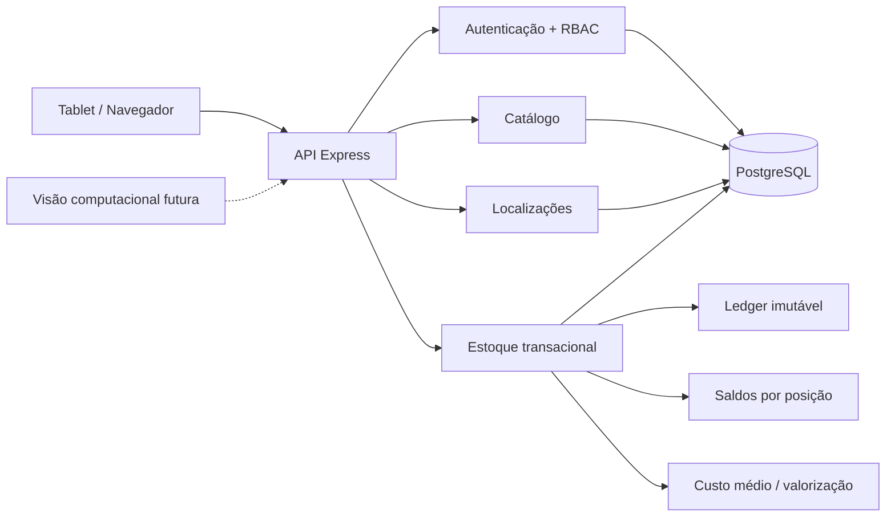

<h1 align="center">A.L.M.A.</h1>
<p align="center"><strong>Armazenamento, Localização, Movimentação e Autenticação</strong></p>
<p align="center">Sistema inteligente de almoxarifado industrial com rastreabilidade física, estoque transacional e operação pensada para tablet.</p>

<p align="center">
  
  
  
  
  <a href="https://github.com/tombemol/A.L.M.A./actions/workflows/ci.yml"></a>
</p>

<p align="center">
  <a href="https://tombemol.github.io/A.L.M.A./"><strong>▶ Abrir demonstração para tablet</strong></a>
</p>

> ✅ **Estado atual:** Fases **1A, 1B e 1C concluídas**. A aplicação já possui autenticação/RBAC, catálogo industrial, estrutura física de almoxarifado e um núcleo transacional de estoque com ledger imutável, saldos por posição, custo médio, transferências, ajustes e rastreabilidade por lote/serial. A próxima etapa é a **Fase 1D**, dedicada às retiradas, destinos, aprovações e histórico operacional.

## 🧭 Visão geral

A **A.L.M.A.** nasceu para estudar como um almoxarifado industrial pode deixar de depender de memória, papel e localização “mais ou menos ali naquela prateleira”. O sistema organiza usuários, produtos, almoxarifados, posições físicas e movimentações com regras explícitas e rastreáveis.

A arquitetura segue um **monólito modular**. Catálogo, localização, autenticação e estoque compartilham uma única fronteira transacional, evitando a interessante tradição humana de distribuir inconsistência por vários serviços e depois chamar isso de arquitetura moderna.

### O que já existe

| Área | Estado | Recursos principais |
| --- | --- | --- |
| Autenticação e RBAC | ✅ Fase 1A | Login de operador/administrador, sessões, papéis e permissões |
| Catálogo industrial | ✅ Fase 1B | Categorias, unidades, produtos, identificadores e conversões |
| Localização física | ✅ Fase 1B | Almoxarifados, hierarquia flexível e posições dedicadas/compartilhadas |
| Produto por posição | ✅ Fase 1B | Múltiplas posições e uma principal por almoxarifado |
| Estoque e movimentações | ✅ Fase 1C | Ledger, saldos, entradas, transferências, ajustes e custo médio |
| Lote, validade e serial | ✅ Fase 1C | LOT, LOT_EXPIRY, SERIAL e SERIAL_EXPIRY |
| Retiradas e histórico operacional | 🚧 Fase 1D | Destino estruturado, aprovação e histórico por usuário |
| Alertas e auditoria | ⏳ Fase 1E | Alertas operacionais e trilha de auditoria ampliada |
| Frontend operacional completo | ⏳ Fase 1F | Fluxos finais integrados à API |
| Visão computacional | 🔭 Futuro | Identificação assistida por câmera e reconhecimento facial complementar |

## 🖥️ Demonstração para tablet

A pasta [`preview/`](./preview/) contém uma demonstração estática, responsiva e totalmente em pt-BR. Ela representa a interface operacional que está sendo construída para uso em tablet.

A demonstração atual possui cinco áreas:

- **Visão geral** com indicadores operacionais;
- **Produtos** com busca, filtros e ficha técnica;
- **Localizações** com posições dedicadas e compartilhadas;
- **Estoque** com saldos por posição, valor estimado, custo médio, lote/serial e movimentações recentes;
- **Leitor** com simulação de SKU e código de barras.

> Os dados do Pages são demonstrativos. O backend da Fase 1C, porém, já implementa as regras transacionais reais de estoque.

A versão pública é publicada automaticamente a partir da `main`:

**https://tombemol.github.io/A.L.M.A./**

O Pages funciona como vitrine da última fase fechada e revisada. Trabalho em andamento permanece em branches de desenvolvimento até passar pelo CI e ser integrado.

## 🏗️ Arquitetura



```text
A.L.M.A./
├── apps/
│   ├── api/          # API Node.js + Express + TypeScript
│   ├── web/          # frontend React da aplicação operacional
│   └── vision/       # reservado para visão computacional futura
├── packages/
│   ├── database/     # Prisma + PostgreSQL
│   └── shared/       # contratos, erros e permissões compartilhadas
├── preview/          # demonstração estática para tablet
└── docs/             # especificações e planos de implementação
```

## 📦 Fase 1C: estoque transacional

A Fase 1C introduz o primeiro núcleo de estoque real da A.L.M.A. Toda movimentação válida atualiza o **ledger histórico**, o **saldo físico** e, quando aplicável, a **valorização** dentro da mesma transação serializável.

### Regras já implementadas

- estoque negativo é bloqueado;
- posições precisam estar ativas e ser do tipo físico `POSITION`;
- o produto precisa estar associado à posição antes de ser movimentado;
- entradas alimentam custo médio móvel ponderado;
- saídas utilizam o custo médio vigente;
- transferências são atômicas e não alteram a valorização global do produto;
- ajustes e ganhos/perdas de inventário exigem justificativa;
- movimentações são registradas em ledger e não reescrevem o histórico anterior;
- lote é normalizado de forma canônica;
- produtos serializados só aceitam quantidade `1` por movimentação;
- um mesmo serial não pode possuir saldo positivo em duas posições simultaneamente;
- validade é obrigatória nos modos `LOT_EXPIRY` e `SERIAL_EXPIRY`.

### Modos de rastreabilidade

```text
NONE
LOT
LOT_EXPIRY
SERIAL
SERIAL_EXPIRY
```

### API de inventário

```text
GET  /api/inventory/balances
GET  /api/inventory/products/:productId/summary
GET  /api/inventory/movements

POST /api/inventory/entries
POST /api/inventory/transfers
POST /api/inventory/adjustments
```

As consultas aceitam filtros conforme o recurso, incluindo produto, localização, almoxarifado, tipo de movimentação, lote e serial. O histórico possui paginação.

As rotas de escrita usam o **usuário autenticado** como responsável pela operação. Um cliente não pode simplesmente mandar outro `performedByUserId` no JSON e inaugurar o conceito de autoria por imaginação.

## 🗺️ Roadmap

| Fase | Escopo | Estado |
| --- | --- | --- |
| **Fase 1A** | Fundação, autenticação, usuários e RBAC | ✅ Concluída |
| **Fase 1B** | Catálogo, produtos, almoxarifados e localizações | ✅ Concluída |
| **Fase 1C** | Estoque, ledger, transferências, rastreabilidade e custos | ✅ Concluída |
| **Fase 1D** | Retiradas, destinos, aprovações e histórico | 🚧 Próxima |
| **Fase 1E** | Alertas e auditoria | ⏳ Planejada |
| **Fase 1F** | Frontend operacional completo | ⏳ Planejada |

## 🧰 Tecnologias

- **Node.js 22+** e **TypeScript**
- **Express 5** para a API
- **PostgreSQL 16** com **Prisma**
- **Zod** para validação de entradas e consultas
- **Argon2id** para credenciais
- **Vitest + Supertest** para testes de backend
- **pnpm workspaces** no monorepo
- **Docker Compose** para desenvolvimento local
- **GitHub Actions** para integração contínua
- **GitHub Pages** para a demonstração pública

## 🔐 Autenticação e permissões

Operadores entram com matrícula/código e PIN. Administradores usam usuário e senha. As credenciais são armazenadas com hash seguro e as sessões usam cookie `HttpOnly`.

```text
POST /api/auth/operator/login
POST /api/auth/admin/login
GET  /api/auth/me
POST /api/auth/logout
```

Permissões principais já disponíveis:

```text
catalog.read
catalog.manage
locations.read
locations.manage
inventory.read
inventory.move
```

## 📚 APIs anteriores

Os módulos de catálogo e localização permanecem disponíveis em:

```text
/api/categories
/api/units
/api/products
/api/warehouses
/api/locations
```

Produtos podem ter vários identificadores e várias posições físicas, respeitando as regras de associação definidas na Fase 1B.

## 🚀 Desenvolvimento local

### Requisitos

- Node.js 22+
- pnpm 10+
- Docker + Docker Compose

### Inicialização

```bash
cp .env.example .env
docker compose up -d
pnpm install
pnpm db:generate
pnpm db:migrate
pnpm db:seed
pnpm dev
```

A API fica disponível em `http://localhost:3000`.

Verificação de saúde:

```bash
curl http://localhost:3000/health
```

Para abrir a demonstração estática localmente, sirva a pasta `preview/` com qualquer servidor HTTP local. E não versione o `.env`. Segredos em Git continuam sendo segredos apenas para quem nunca abriu o repositório.

## 👤 Bootstrap administrativo

Configure localmente:

```dotenv
BOOTSTRAP_ADMIN_USERNAME=admin
BOOTSTRAP_ADMIN_PASSWORD=uma-senha-local-forte
```

Depois execute:

```bash
pnpm db:seed
```

O seed é idempotente e a senha permanece fora do repositório.

## 🧪 Qualidade

O CI executa geração do Prisma, migrations, seed idempotente, verificação de tipos, testes de backend, testes da demonstração, validação sintática do JavaScript e build.

```bash
pnpm typecheck
pnpm test
node --test preview/test/*.test.mjs
node --check preview/app.js
pnpm build
```

A suíte da Fase 1C cobre, entre outros pontos, saldo negativo, concorrência, custo médio, saída valorizada, transferência atômica, ajustes, lote, validade, serial, RBAC e contrato HTTP.

## 📚 Documentação técnica

- [`Design geral da Fase 1`](./docs/superpowers/specs/2026-09-16-alma-phase-1-design.md)
- [`Roadmap da Fase 1`](./docs/superpowers/plans/2026-09-16-alma-phase-1-roadmap.md)
- [`Plano da Fase 1A`](./docs/superpowers/plans/2026-09-16-alma-phase-1a-foundation-auth.md)
- [`Design da Fase 1B`](./docs/superpowers/specs/2026-09-16-alma-phase-1b-catalog-locations-design.md)
- [`Plano da Fase 1B`](./docs/superpowers/plans/2026-09-16-alma-phase-1b-catalog-locations.md)
- [`Plano da Fase 1C`](./docs/superpowers/plans/2026-09-16-alma-phase-1c-inventory-ledger.md)

---

<p align="center"><strong>A.L.M.A.</strong> · porque “deve estar naquela prateleira” não é uma estratégia de inventário.</p>
