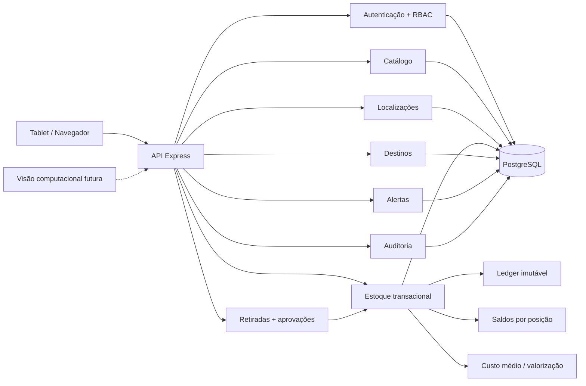

<h1 align="center">A.L.M.A.</h1>
<p align="center"><strong>Armazenamento, Localização, Movimentação e Autenticação</strong></p>
<p align="center">Sistema inteligente de almoxarifado industrial com rastreabilidade física, estoque transacional, alertas operacionais e auditoria.</p>

<p align="center">
  
  
  
  
  <a href="https://github.com/tombemol/A.L.M.A/actions/workflows/ci.yml"></a>
</p>

<p align="center">
  <a href="https://tombemol.github.io/A.L.M.A/"><strong>▶ Abrir demonstração para tablet</strong></a>
</p>

> ✅ **Estado atual:** Fases **1A, 1B, 1C, 1D e 1E concluídas**. O núcleo de backend já cobre autenticação/RBAC, catálogo, localização física, estoque transacional, retiradas com aprovação, políticas de reposição, alertas idempotentes e trilha de auditoria. A próxima etapa é a **Fase 1F**, que transforma esses contratos em um frontend operacional completo.

## 🧭 Visão geral

A **A.L.M.A.** nasceu para tirar o almoxarifado da clássica tecnologia industrial “acho que está naquela prateleira”. O sistema organiza usuários, produtos, posições físicas, saldos, movimentações, retiradas, alertas e evidências com regras explícitas e histórico preservado.

A arquitetura segue um **monólito modular**. Os domínios compartilham a mesma fronteira transacional em PostgreSQL, mas ficam separados por responsabilidade: autenticação, catálogo, localizações, estoque, destinos, retiradas, alertas e auditoria. Fluxos críticos usam transações serializáveis para impedir meia operação salva e meia operação perdida, porque banco de dados não deveria praticar interpretação artística.

### O que já existe

| Área | Estado | Recursos principais |
| --- | --- | --- |
| Autenticação e RBAC | ✅ Fase 1A | Login de operador/administrador, sessões, papéis e permissões |
| Catálogo industrial | ✅ Fase 1B | Categorias, unidades, produtos, identificadores e conversões |
| Localização física | ✅ Fase 1B | Almoxarifados, hierarquia flexível e posições dedicadas/compartilhadas |
| Produto por posição | ✅ Fase 1B | Múltiplas posições e uma principal por almoxarifado |
| Estoque e movimentações | ✅ Fase 1C | Ledger, saldos, entradas, transferências, ajustes e custo médio |
| Lote, validade e serial | ✅ Fase 1C | LOT, LOT_EXPIRY, SERIAL e SERIAL_EXPIRY |
| Retiradas e aprovações | ✅ Fase 1D | Solicitação, aprovação/rejeição, atendimento e retirada direta segura |
| Destinos e histórico | ✅ Fase 1D | Setor, equipamento, OS e movimento de estoque vinculado |
| Alertas operacionais | ✅ Fase 1E | Reposição, mínimo, ruptura, validade, vencimento e fragmentação |
| Auditoria | ✅ Fase 1E | Eventos append-only com ator, ação, entidade, antes/depois e contexto |
| Frontend operacional completo | 🚧 Fase 1F | Fluxos finais integrados à API |
| Visão computacional | 🔭 Futuro | Identificação assistida por câmera e reconhecimento facial complementar |

## 🖥️ Demonstração para tablet

A pasta [`preview/`](./preview/) contém uma demonstração estática e responsiva em pt-BR. Ela funciona como vitrine dos fluxos e da linguagem visual que será levada para o frontend React da Fase 1F.

A demonstração possui oito áreas:

- **Visão geral** com indicadores e atenção operacional;
- **Produtos** com busca, filtros e ficha técnica;
- **Localizações** com posições dedicadas e compartilhadas;
- **Estoque** com saldos por posição, custo médio e movimentações;
- **Retiradas** com fila operacional e histórico;
- **Alertas** com severidade, condição, material e leitura;
- **Auditoria** com ator, ação, entidade e alteração registrada;
- **Leitor** com simulação de SKU/código de barras.

> Os dados do GitHub Pages são demonstrativos. O backend implementa as regras transacionais reais.

### Design system: Industrial Control Room

O preview deixou de usar a estética genérica de dashboard SaaS e passou a seguir o design system **Industrial Control Room**:

- IBM Plex Sans para interface e IBM Plex Mono para códigos/dados técnicos;
- superfícies grafite planas, sem gradientes decorativos ou glow;
- âmbar de segurança como destaque principal;
- vermelho/verde/azul apenas com função semântica;
- cantos discretos, poucos cartões e hierarquia por tipografia/divisores;
- densidade pensada para operação em tablet;
- alvos de toque, contraste e foco adequados para uso operacional.

As decisões de produto e design ficam documentadas em [`PRODUCT.md`](./PRODUCT.md) e [`DESIGN.md`](./DESIGN.md).

O CI executa o detector do **Impeccable 4.1.0** sobre `preview/`, impedindo regressões como texto excessivamente pequeno, contraste insuficiente e padrões visuais típicos de “AI slop”.

## 🏗️ Arquitetura



```text
A.L.M.A/
├── apps/
│   ├── api/          # API Node.js + Express + TypeScript
│   ├── web/          # frontend React da aplicação operacional
│   └── vision/       # reservado para visão computacional futura
├── packages/
│   ├── database/     # Prisma + PostgreSQL
│   └── shared/       # contratos, erros e permissões compartilhadas
├── preview/          # demonstração estática tablet-first
├── docs/             # specs e planos de implementação
├── PRODUCT.md        # contexto do produto e do operador
└── DESIGN.md         # sistema visual Industrial Control Room
```

## 📦 Fase 1C: estoque transacional

A Fase 1C introduziu o núcleo de estoque real. Toda movimentação válida atualiza o **ledger histórico**, o **saldo físico** e, quando aplicável, a **valorização** dentro da mesma transação serializável.

Regras principais:

- estoque negativo é bloqueado;
- posições precisam estar ativas e ser físicas (`POSITION`);
- produto precisa estar associado à posição;
- entradas alimentam custo médio móvel ponderado;
- saídas usam o custo médio vigente;
- transferências são atômicas;
- ajustes e ganhos/perdas exigem justificativa;
- lote é normalizado de forma canônica;
- produto serializado aceita quantidade `1` por movimentação;
- serial não pode possuir saldo positivo em duas posições simultaneamente;
- validade é obrigatória nos modos `LOT_EXPIRY` e `SERIAL_EXPIRY`.

### API de inventário

```text
GET  /api/inventory/balances
GET  /api/inventory/products/:productId/summary
GET  /api/inventory/movements

POST /api/inventory/entries
POST /api/inventory/transfers
POST /api/inventory/adjustments
```

O endpoint genérico de movimentações não aceita `WITHDRAWAL`. Saídas operacionais passam pelo módulo de retiradas.

## 📤 Fase 1D: retiradas, destinos e aprovações

A Fase 1D fecha o ciclo entre intenção de uso e saída física. A política de aprovação é congelada na solicitação, evitando que uma mudança futura de cadastro reescreva o motivo histórico de uma operação anterior.

Invariantes principais:

- toda solicitação possui setor;
- equipamento e OS são opcionais, mas precisam ser compatíveis;
- solicitar/aprovar/rejeitar não altera estoque;
- material controlado só sai após aprovação;
- decisão é única;
- atendimento cria exatamente uma movimentação `WITHDRAWAL`;
- atendimento e baixa de estoque ocorrem na mesma transação;
- retirada direta existe apenas para material sem aprovação obrigatória;
- ator autenticado determina solicitante/aprovador/almoxarife;
- histórico relaciona destino, atores e movimento de estoque.

### API de retiradas

```text
GET  /api/withdrawal-requests
GET  /api/withdrawal-requests/:id
POST /api/withdrawal-requests
POST /api/withdrawal-requests/:id/approve
POST /api/withdrawal-requests/:id/reject
POST /api/withdrawal-requests/:id/fulfill
POST /api/withdrawals/direct
```

### API de destinos

```text
GET  /api/destinations/departments
POST /api/destinations/departments
PATCH /api/destinations/departments/:id

GET  /api/destinations/equipment
POST /api/destinations/equipment
PATCH /api/destinations/equipment/:id

GET  /api/destinations/work-orders
POST /api/destinations/work-orders
PATCH /api/destinations/work-orders/:id
```

## 🚨 Fase 1E: alertas operacionais

Cada produto pode possuir uma `ReorderPolicy` com:

- estoque mínimo;
- estoque máximo;
- ponto de reposição;
- antecedência em dias para alerta de validade.

O motor avalia seis condições:

| Tipo | Significado |
| --- | --- |
| `REORDER` | saldo atingiu o ponto de reposição |
| `BELOW_MINIMUM` | saldo abaixo do mínimo configurado |
| `STOCKOUT` | produto sem saldo disponível |
| `EXPIRY_NEAR` | lote/serial próximo do vencimento |
| `EXPIRED` | lote/serial vencido ainda com saldo |
| `FRAGMENTATION` | saldo positivo distribuído em múltiplas posições |

Alertas são **idempotentes enquanto ativos**: a mesma condição atualiza a ocorrência existente em vez de criar duplicatas. Quando a condição deixa de existir, o alerta é resolvido; se reaparecer depois, uma nova ocorrência histórica é criada.

### API de alertas

```text
GET  /api/alerts
POST /api/alerts/evaluate
GET  /api/alerts/policies/:productId
PUT  /api/alerts/policies/:productId
```

A listagem permite filtros por produto, tipo, severidade e estado ativo/resolvido.

## 🧾 Fase 1E: auditoria ampliada

`AuditLog` registra ações sensíveis como eventos append-only. O log pode conter:

- usuário/ator;
- ação;
- tipo e id da entidade;
- valores anteriores e posteriores quando relevantes;
- contexto técnico sanitizado;
- data/hora.

A auditoria é escrita **dentro da mesma transação** dos fluxos críticos de estoque e retirada. Portanto, não existe o divertido cenário em que o log afirma que algo aconteceu enquanto a transação real voltou atrás.

Eventos atuais incluem políticas de reposição, avaliação de alertas, entradas, transferências, ajustes, devoluções, retiradas, solicitações, aprovações, rejeições e atendimentos.

```text
GET /api/audit
```

A consulta suporta filtros por ator, ação, entidade, id, intervalo de datas e paginação.

## 🔐 Autenticação e permissões

Operadores entram com matrícula/código e PIN. Administradores usam usuário e senha. Credenciais são armazenadas com hash seguro e sessões usam cookie `HttpOnly`.

```text
POST /api/auth/operator/login
POST /api/auth/admin/login
GET  /api/auth/me
POST /api/auth/logout
```

Permissões disponíveis:

```text
users.read
users.manage
roles.read
roles.manage
admin.access
catalog.read
catalog.manage
locations.read
locations.manage
inventory.read
inventory.move
destinations.read
destinations.manage
withdrawals.read
withdrawals.request
withdrawals.approve
withdrawals.fulfill
alerts.read
alerts.manage
audit.read
```

## 🗺️ Roadmap

| Fase | Escopo | Estado |
| --- | --- | --- |
| **1A** | Fundação, autenticação, usuários e RBAC | ✅ Concluída |
| **1B** | Catálogo, produtos, almoxarifados e localizações | ✅ Concluída |
| **1C** | Estoque, ledger, transferências, rastreabilidade e custos | ✅ Concluída |
| **1D** | Retiradas, destinos, aprovações e histórico | ✅ Concluída |
| **1E** | Políticas de reposição, alertas e auditoria | ✅ Concluída |
| **1F** | Frontend operacional completo + QR/barcode | 🚧 Próxima |

## 🧰 Tecnologias

- **Node.js 22+** e **TypeScript**
- **Express 5**
- **PostgreSQL 16** + **Prisma 6**
- **Zod**
- **Argon2id**
- **Vitest + Supertest**
- **pnpm workspaces**
- **Docker Compose**
- **GitHub Actions**
- **GitHub Pages**
- **Impeccable 4.1.0** como gate visual do preview

## 🚀 Desenvolvimento local

### Requisitos

- Node.js 22+
- pnpm 10+
- Docker + Docker Compose

### Inicialização

```bash
cp .env.example .env
docker compose up -d
pnpm install
pnpm db:generate
pnpm db:migrate
pnpm db:seed
pnpm dev
```

A API fica em `http://localhost:3000`.

```bash
curl http://localhost:3000/health
```

Para abrir o preview, sirva a pasta `preview/` com qualquer servidor HTTP. E não versione `.env`. Segredo com histórico de commit é só um segredo com documentação arqueológica.

## 👤 Bootstrap administrativo

Configure localmente:

```dotenv
BOOTSTRAP_ADMIN_USERNAME=admin
BOOTSTRAP_ADMIN_PASSWORD=uma-senha-local-forte
```

Depois:

```bash
pnpm db:seed
```

O seed é idempotente.

## 🧪 Qualidade

O CI executa migrations, seed idempotente, tipos, testes, validação da demonstração, detector visual e build.

```bash
pnpm typecheck
pnpm test
node --test preview/test/*.test.mjs
node --check preview/app.js
npx --yes impeccable@4.1.0 detect preview/
pnpm build
```

A suíte cobre autenticação/RBAC, catálogo, localização, estoque negativo, concorrência, custo médio, transferência atômica, lote/serial, política de aprovação, decisões únicas, atendimento idempotente, rollback por falta de saldo, alertas idempotentes, filtros de auditoria, auditoria transacional e contrato HTTP.

## 📚 Documentação técnica

- [`Contexto do produto`](./PRODUCT.md)
- [`Design system Industrial Control Room`](./DESIGN.md)
- [`Design geral da Fase 1`](./docs/superpowers/specs/2026-09-16-alma-phase-1-design.md)
- [`Roadmap da Fase 1`](./docs/superpowers/plans/2026-09-16-alma-phase-1-roadmap.md)
- [`Plano da Fase 1A`](./docs/superpowers/plans/2026-09-16-alma-phase-1a-foundation-auth.md)
- [`Design da Fase 1B`](./docs/superpowers/specs/2026-09-16-alma-phase-1b-catalog-locations-design.md)
- [`Plano da Fase 1B`](./docs/superpowers/plans/2026-09-16-alma-phase-1b-catalog-locations.md)
- [`Plano da Fase 1C`](./docs/superpowers/plans/2026-09-16-alma-phase-1c-inventory-ledger.md)
- [`Plano da Fase 1D`](./docs/superpowers/plans/2026-09-16-alma-phase-1d-withdrawals-approvals.md)
- [`Design da Fase 1E`](./docs/superpowers/specs/2026-09-16-alma-phase-1e-alerts-audit-design.md)
- [`Plano da Fase 1E`](./docs/superpowers/plans/2026-09-16-alma-phase-1e-alerts-audit.md)

---

<p align="center"><strong>A.L.M.A.</strong> · porque “deve estar naquela prateleira” não é estratégia de inventário.</p>
