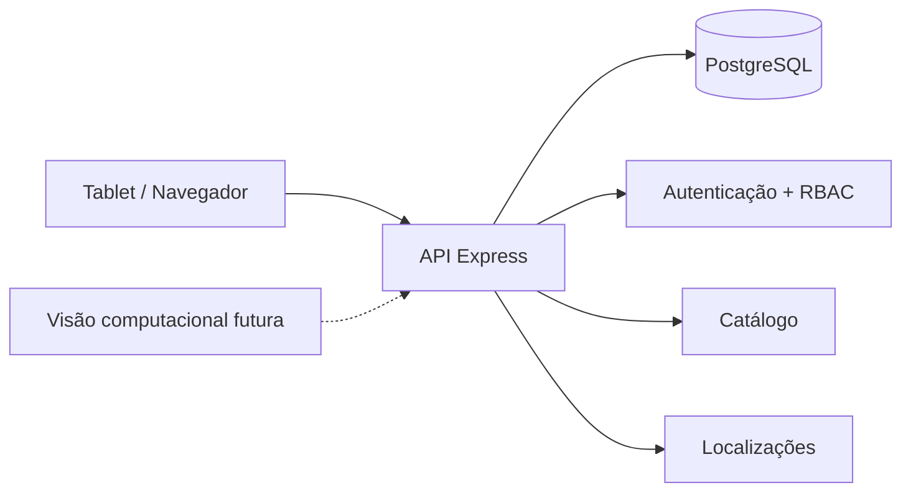

<h1 align="center">A.L.M.A.</h1>
<p align="center"><strong>Armazenamento, Localização, Movimentação e Autenticação</strong></p>
<p align="center">Sistema inteligente de almoxarifado industrial, construído como projeto de estudo com foco em rastreabilidade, localização física e operações seguras.</p>

<p align="center">
  
  
  
  
  <a href="https://github.com/tombemol/A.L.M.A./actions/workflows/ci.yml"></a>
</p>

> 🚧 **Estado atual:** Fase 1A concluída. A Fase 1B está em desenvolvimento com catálogo industrial, almoxarifados e endereçamento físico já implementados no backend.

## 🧭 Visão geral

A **A.L.M.A.** nasceu para estudar como um almoxarifado industrial pode deixar de depender de memória, papel e localização “mais ou menos ali naquela prateleira”. O núcleo da aplicação organiza produtos, usuários, permissões, almoxarifados e posições físicas com regras de domínio explícitas e rastreáveis.

A proposta evolui por fases. O sistema começa como um monólito modular e, posteriormente, recebe estoque transacional, retiradas, aprovações, auditoria, leitura por câmera e serviços especializados de visão computacional.

### O que já existe

| Área | Estado | Recursos principais |
| --- | --- | --- |
| Autenticação e RBAC | ✅ Disponível | Login de operador e administrador, sessões seguras, papéis e permissões |
| Catálogo industrial | ✅ Backend pronto na 1B | Categorias, unidades, produtos, identificadores e conversões |
| Localização física | ✅ Backend pronto na 1B | Almoxarifados, hierarquia flexível e posições dedicadas/compartilhadas |
| Produto por posição | ✅ Backend pronto na 1B | Múltiplas posições e uma localização principal por almoxarifado |
| Estoque e movimentações | ⏳ Próxima fase | Entradas, transferências, saldos e custos |
| Retiradas e histórico | ⏳ Planejado | Destino estruturado, aprovações e histórico por usuário |
| Visão computacional | 🔭 Futuro | Identificação assistida por câmera e reconhecimento facial complementar |

## 🖥️ Demonstração para tablet

A pasta [`preview/`](./preview/) contém uma demonstração estática e responsiva da interface pensada para operação em tablet. Ela permite navegar por visão geral, produtos, localizações e um leitor simulado de códigos.

> A publicação automática por GitHub Pages já está configurada em `.github/workflows/pages.yml`. O repositório ainda precisa ter o GitHub Pages habilitado uma vez nas configurações para que a URL pública seja criada.

## 🏗️ Arquitetura



O projeto usa um **monólito modular** para manter as regras centrais próximas e transacionais, sem criar uma coleção de microserviços só porque a indústria de software aparentemente ficou entediada com processos simples.

```text
A.L.M.A./
├── apps/
│   ├── api/          # API Node.js + Express + TypeScript
│   ├── web/          # frontend React da aplicação operacional
│   └── vision/       # reservado para visão computacional futura
├── packages/
│   ├── database/     # Prisma + PostgreSQL
│   ├── shared/       # contratos e regras compartilhadas
│   └── validation/   # validações reutilizáveis
├── preview/          # demonstração estática para tablet
├── docs/             # especificações e planos de implementação
└── docker/           # infraestrutura local
```

## 🗺️ Roadmap

| Fase | Escopo | Estado |
| --- | --- | --- |
| **Fase 1A** | Fundação, autenticação, usuários e RBAC | ✅ Concluída |
| **Fase 1B** | Catálogo, produtos, almoxarifados e localizações | 🚧 Em desenvolvimento |
| **Fase 1C** | Estoque, entradas, transferências e custos | ⏳ Planejada |
| **Fase 1D** | Retiradas, destinos, aprovações e histórico | ⏳ Planejada |
| **Fase 1E** | Alertas e auditoria | ⏳ Planejada |
| **Fase 1F** | Frontend operacional completo | ⏳ Planejada |

## 🧰 Tecnologias

- **Node.js 22+** e **TypeScript**
- **Express 5** para a API
- **PostgreSQL 16** com **Prisma**
- **Zod** para validação de entradas
- **Argon2id** para credenciais
- **Vitest + Supertest** para testes de backend
- **pnpm workspaces** no monorepo
- **Docker Compose** para desenvolvimento local
- **GitHub Actions** para integração contínua

## 🔐 Autenticação e permissões

Operadores entram com matrícula/código e PIN. Administradores usam usuário e senha. As credenciais são armazenadas com hash seguro e as sessões usam cookie `HttpOnly`.

```text
POST /api/auth/operator/login
POST /api/auth/admin/login
GET  /api/auth/me
POST /api/auth/logout
```

A autorização é baseada em permissões, incluindo:

```text
catalog.read
catalog.manage
locations.read
locations.manage
```

## 📦 API da Fase 1B

Os módulos atuais estão disponíveis em:

```text
/api/categories
/api/units
/api/products
/api/warehouses
/api/locations
```

As rotas de leitura e escrita respeitam RBAC no backend. Produtos podem ter vários identificadores e várias posições, mas apenas uma posição principal por almoxarifado.

## 🚀 Desenvolvimento local

### Requisitos

- Node.js 22+
- pnpm 10+
- Docker + Docker Compose

### Inicialização

```bash
cp .env.example .env
docker compose up -d
pnpm install
pnpm db:generate
pnpm db:migrate
pnpm db:seed
pnpm dev
```

A API fica disponível em `http://localhost:3000`.

Verificação de saúde:

```bash
curl http://localhost:3000/health
```

Para abrir a demonstração estática localmente, sirva a pasta `preview/` com qualquer servidor HTTP local. Não use o arquivo `.env` como souvenir de commit. Ele contém configuração que deve continuar local.

## 👤 Bootstrap administrativo

Para criar ou atualizar um administrador inicial, configure localmente:

```dotenv
BOOTSTRAP_ADMIN_USERNAME=admin
BOOTSTRAP_ADMIN_PASSWORD=uma-senha-local-forte
```

Depois execute:

```bash
pnpm db:seed
```

O seed é idempotente e a senha permanece fora do repositório.

## 🧪 Qualidade

O fluxo de integração contínua executa geração do Prisma, migrations, seed idempotente, verificação de tipos, testes de backend, testes da demonstração e build.

```bash
pnpm typecheck
pnpm test
node --test preview/test/*.test.mjs
node --check preview/app.js
pnpm build
```

## 📚 Documentação técnica

- [`Design geral da Fase 1`](./docs/superpowers/specs/2026-09-16-alma-phase-1-design.md)
- [`Roadmap da Fase 1`](./docs/superpowers/plans/2026-09-16-alma-phase-1-roadmap.md)
- [`Plano da Fase 1A`](./docs/superpowers/plans/2026-09-16-alma-phase-1a-foundation-auth.md)
- [`Design da Fase 1B`](./docs/superpowers/specs/2026-09-16-alma-phase-1b-catalog-locations-design.md)
- [`Plano da Fase 1B`](./docs/superpowers/plans/2026-09-16-alma-phase-1b-catalog-locations.md)

---

<p align="center"><strong>A.L.M.A.</strong> · um projeto de estudo que prefere saber onde o material está em vez de desenvolver fé na memória coletiva da fábrica.</p>
