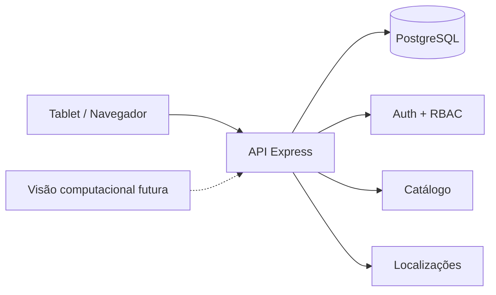

# A.L.M.A. Phase 1B — Catálogo + Localizações Implementation Plan

> **For agentic workers:** REQUIRED SUB-SKILL: Use superpowers:subagent-driven-development (recommended) or superpowers:executing-plans to implement this plan task-by-task. Steps use checkbox (`- [ ]`) syntax for tracking.

**Goal:** Implementar catálogo industrial, unidades, identificadores, almoxarifados, endereçamento físico flexível e associação produto-localização, preparando a Fase 1C.

**Architecture:** A Fase 1B mantém o monólito modular. O Prisma modela dados e restrições estruturais; services concentram regras de negócio e transações; rotas Express fazem validação Zod, autenticação e RBAC. Nenhuma quantidade de estoque é criada nesta fase.

**Tech Stack:** Node.js 22+, TypeScript, Express 5, Prisma, PostgreSQL 16+, Zod, Vitest, Supertest, pnpm, Docker Compose.

**Spec:** `docs/superpowers/specs/2026-09-16-alma-phase-1b-catalog-locations-design.md`

## Global Constraints

- Toda interface e documentação voltada ao usuário deve permanecer em pt-BR.
- SKU é obrigatório e único, normalizado com `trim().toUpperCase()`.
- Categoria é hierárquica e não pode formar ciclos.
- Unidade base é obrigatória; conversões alternativas usam fator positivo para a unidade base.
- Almoxarifado é obrigatório; níveis `AISLE`, `RACK`, `SHELF` e `POSITION` são opcionais, mas a ordem nunca retrocede.
- Apenas `POSITION` recebe produto.
- Posição `DEDICATED` aceita no máximo um produto; `SHARED` aceita vários.
- Um produto possui no máximo uma localização principal por almoxarifado.
- Cadastros são desativados, não removidos, quando já podem participar de histórico futuro.
- Estoque, saldo, entrada, saída, custos, lotes e retiradas permanecem fora da 1B.

---

### Task 1: Persistência e permissões da 1B

**Files:**
- Modify: `packages/database/prisma/schema.prisma`
- Create: `packages/database/prisma/migrations/20260916130000_catalog_locations/migration.sql`
- Modify: `packages/shared/src/permissions.ts`
- Modify: `packages/database/prisma/seed.ts`
- Test: `apps/api/test/catalog.schema.test.ts`

**Interfaces:**
- Produces Prisma models: `Category`, `UnitOfMeasure`, `Product`, `ProductIdentifier`, `ProductUnitConversion`, `Warehouse`, `StorageLocation`, `ProductLocation`.
- Produces enums: `ProductIdentifierType`, `StorageLocationKind`, `OccupancyMode`.
- Produces permissions: `catalog.read`, `catalog.manage`, `locations.read`, `locations.manage`.

- [ ] **Step 1: escrever teste de persistência** criando categoria, unidade, produto, almoxarifado, posição e associação; confirmar unicidade de SKU/identificador.
- [ ] **Step 2: executar `pnpm test:api -- catalog.schema.test.ts` e confirmar falha por modelos ausentes.**
- [ ] **Step 3: adicionar os modelos e enums ao Prisma**, usando `Decimal` para `factorToBase`, `onDelete: Restrict` nas referências de catálogo e `@@unique([warehouseId, code])` em localização.
- [ ] **Step 4: criar migration SQL**, incluindo índice parcial:

```sql
CREATE UNIQUE INDEX "ProductLocation_primary_per_warehouse"
ON "ProductLocation" ("productId", "warehouseId")
WHERE "isPrimary" = true;
```

- [ ] **Step 5: ampliar `PERMISSIONS`**:

```ts
CATALOG_READ: "catalog.read",
CATALOG_MANAGE: "catalog.manage",
LOCATIONS_READ: "locations.read",
LOCATIONS_MANAGE: "locations.manage",
```

- [ ] **Step 6: ampliar seed** para dar todas as quatro permissões a `ADMIN` e `ALMOXARIFE`, e leitura a `SOLICITANTE` e `APROVADOR`.
- [ ] **Step 7: rodar `pnpm db:generate`, migration, seed duas vezes e o teste.**
- [ ] **Step 8: commit `feat: add catalog and location data model`.**

---

### Task 2: Categorias e unidades

**Files:**
- Create: `apps/api/src/modules/catalog/catalog.schemas.ts`
- Create: `apps/api/src/modules/catalog/categories.service.ts`
- Create: `apps/api/src/modules/catalog/categories.routes.ts`
- Create: `apps/api/src/modules/catalog/units.service.ts`
- Create: `apps/api/src/modules/catalog/units.routes.ts`
- Test: `apps/api/test/catalog.categories-units.test.ts`

**Interfaces:**
- `listCategories()`, `createCategory(input)`, `updateCategory(id,input)`.
- `listUnits()`, `createUnit(input)`, `updateUnit(id,input)`.

- [ ] **Step 1: teste vermelho** cobrindo criação hierárquica, bloqueio de ciclo, normalização de código e RBAC.
- [ ] **Step 2: implementar schemas Zod** com nomes e mensagens em pt-BR.
- [ ] **Step 3: implementar `categories.service.ts`**. Antes de mudar `parentId`, percorrer ancestrais até raiz; se o próprio ID aparecer, lançar `CATEGORY_CYCLE` 409.
- [ ] **Step 4: implementar `units.service.ts`** com código maiúsculo e conflito `DUPLICATE_CODE` 409.
- [ ] **Step 5: implementar rotas** com `catalog.read` para GET e `catalog.manage` para POST/PATCH.
- [ ] **Step 6: executar testes e typecheck.**
- [ ] **Step 7: commit `feat: add categories and units API`.**

---

### Task 3: Produtos, identificadores e conversões

**Files:**
- Create: `apps/api/src/modules/catalog/products.service.ts`
- Create: `apps/api/src/modules/catalog/products.routes.ts`
- Extend: `apps/api/src/modules/catalog/catalog.schemas.ts`
- Test: `apps/api/test/catalog.products.test.ts`

**Interfaces:**
- `listProducts(query)`.
- `getProduct(id)`.
- `resolveProduct(identifier)`.
- `createProduct(input)`.
- `updateProduct(id,input)`.
- `addProductIdentifier(productId,input)`.
- `removeProductIdentifier(productId,identifierId)`.
- `replaceProductConversions(productId,input)`.

- [ ] **Step 1: testes vermelhos** para SKU único, resolução por SKU/identificador, identificador globalmente único, conversão positiva e proibição da unidade base como conversão.
- [ ] **Step 2: criar produto transacionalmente** com identificadores/conversões iniciais, validando categoria e unidade ativas.
- [ ] **Step 3: resolver por SKU normalizado ou `ProductIdentifier.normalizedValue`** e retornar `NOT_FOUND` quando inexistente.
- [ ] **Step 4: substituir conversões em uma transação**, rejeitando fator `<= 0` e unidade base.
- [ ] **Step 5: expor rotas definidas na spec**, protegidas por `catalog.read`/`catalog.manage`.
- [ ] **Step 6: testes + typecheck.**
- [ ] **Step 7: commit `feat: add product catalog API`.**

---

### Task 4: Almoxarifados e hierarquia física flexível

**Files:**
- Create: `apps/api/src/modules/locations/locations.schemas.ts`
- Create: `apps/api/src/modules/locations/warehouses.service.ts`
- Create: `apps/api/src/modules/locations/warehouses.routes.ts`
- Create: `apps/api/src/modules/locations/storage-locations.service.ts`
- Create: `apps/api/src/modules/locations/storage-locations.routes.ts`
- Test: `apps/api/test/locations.hierarchy.test.ts`

**Interfaces:**
- `listWarehouses()`, `createWarehouse(input)`, `updateWarehouse(id,input)`.
- `listLocations(warehouseId)`.
- `createStorageLocation(warehouseId,input)`.
- `updateStorageLocation(id,input)`.

- [ ] **Step 1: testes vermelhos** para níveis omitidos válidos, retrocesso inválido, pai em outro almoxarifado, ciclo e `occupancyMode` obrigatório apenas em `POSITION`.
- [ ] **Step 2: implementar mapa de ordem:**

```ts
const LOCATION_ORDER = { AISLE: 1, RACK: 2, SHELF: 3, POSITION: 4 } as const;
```

- [ ] **Step 3: validar parentesco**: pai nulo é aceito; com pai, ambos devem estar no mesmo almoxarifado e `LOCATION_ORDER[parent.kind] < LOCATION_ORDER[child.kind]`.
- [ ] **Step 4: na atualização de pai, percorrer ancestrais e rejeitar `LOCATION_CYCLE` 409.**
- [ ] **Step 5: rotas usam `locations.read` para GET e `locations.manage` para escrita.**
- [ ] **Step 6: testes + typecheck.**
- [ ] **Step 7: commit `feat: add warehouse location hierarchy`.**

---

### Task 5: Associação produto-localização

**Files:**
- Create: `apps/api/src/modules/locations/product-locations.service.ts`
- Create: `apps/api/src/modules/locations/product-locations.routes.ts`
- Extend: `apps/api/src/modules/locations/locations.schemas.ts`
- Test: `apps/api/test/locations.product-association.test.ts`

**Interfaces:**
- `listProductLocations(productId)`.
- `associateProductLocation(productId,input)`.
- `removeProductLocation(productId,associationId)`.

- [ ] **Step 1: testes vermelhos** para posição dedicada, compartilhada, localização inativa, produto inativo e uma principal por almoxarifado.
- [ ] **Step 2: associação transacional** deve validar produto, localização `POSITION`, almoxarifado e ocupação.
- [ ] **Step 3: se `isPrimary=true`, desmarcar a principal anterior do mesmo produto/almoxarifado e criar/atualizar associação na mesma transação.**
- [ ] **Step 4: remoção física da associação é permitida na 1B porque ainda não existe histórico de estoque; a 1C deverá revisar essa política antes de usar a associação em ledger.**
- [ ] **Step 5: testes + typecheck.**
- [ ] **Step 6: commit `feat: add product location assignments`.**

---

### Task 6: Wiring HTTP e regressão completa

**Files:**
- Modify: `apps/api/src/app.ts`
- Test: all `apps/api/test/*.test.ts`

**Interfaces:**
- Mount `/api/categories`, `/api/units`, `/api/products`, `/api/warehouses`, `/api/locations`.

- [ ] **Step 1: montar routers no `app.ts`.**
- [ ] **Step 2: executar `pnpm db:generate`, `pnpm db:migrate:deploy`, seed duas vezes, `pnpm typecheck`, `pnpm test`, `node --test preview/test/*.test.mjs`, `node --check preview/app.js`, `pnpm build`.**
- [ ] **Step 3: corrigir somente regressões relacionadas à 1B.**
- [ ] **Step 4: commit `feat: wire phase 1B API`.**

---

### Task 7: Vitrine pt-BR e README visual

**Files:**
- Modify: `README.md`
- Modify: `preview/index.html`
- Modify: `preview/app.js`
- Modify: `preview/test/preview.test.mjs`

**Interfaces:**
- README deve apresentar visão, arquitetura, roadmap, stack, preview e execução local.
- Toda cópia visível do preview deve estar em pt-BR.

- [ ] **Step 1: adicionar badges no topo do README** para Node, TypeScript, PostgreSQL, Prisma e CI.
- [ ] **Step 2: adicionar link destacado do preview temporário.**
- [ ] **Step 3: adicionar Mermaid da arquitetura:**



- [ ] **Step 4: adicionar roadmap visual 1A–1F**, marcando 1A concluída, 1B em desenvolvimento e fases futuras.
- [ ] **Step 5: trocar rótulos visíveis restantes do preview**, incluindo `Dashboard` -> `Visão geral`, `Scanner` -> `Leitor`, `Admin Demo` -> `Administrador de demonstração`, `Tablet Preview` -> `Demonstração para tablet`.
- [ ] **Step 6: atualizar teste estático para exigir os novos rótulos pt-BR.**
- [ ] **Step 7: rodar testes do preview e CI completo.**
- [ ] **Step 8: commit `docs: improve pt-BR project presentation`.**

## Self-review

Cobertura confirmada: categorias, unidades, produtos, identificadores, conversões, almoxarifados, hierarquia flexível, ocupação dedicada/compartilhada, localização principal, RBAC, regressão, README e padronização pt-BR. Não há implementação de quantidade, retirada, histórico de retirada ou custos, que continuam reservados às fases posteriores conforme a spec.
